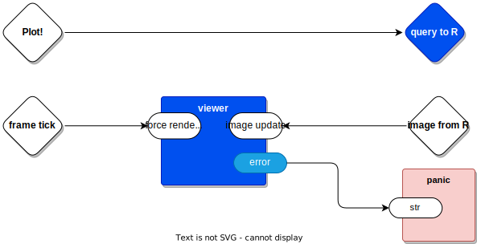

# Topmost Overview
*[Thinking about https://docs.google.com/document/d/1EbK4AxDCDWonMa8KyGJFX4jllXXLew0qBsGxsmqoYqk/edit?pli=1]*

As I understand it, there are 3 inputs and 1 output and one unspecified image rendering thingie.

And, there is a `panic` situation if any kind of error occurs (I'm too lazy to think about how to handle errors).

Is that about right?

## Inputs
1. `Plot!` - button push by user, data: don't care (maybe seen as a Boolean (actually a Bang, a pulse))
2. `frame tick` - fires every time there is a new frame to be displayed, data: don't care
3. `image from R` - fires every time R sends a new image, data: image
## Output
1. `query to R` - sent every time a new image is requested from R ; in this case, this is essentially the same as the `Plot!` input above
## Rendering Thingie
- a lump of code that can be called to render an image, the image is passed in as a parameter
## Panic
- an assert fail
# Refinements 1-5

Basically, you considered the problem in more and more depth and teased out more details in a spiralling-in fashion.  

This is *iterative design*.  It happens.  Live with it.  

You can't help it, you have to live with this reality.  You wish that you had tools that supported iterative refinement of ideas.

Over-specifying details, such as worrying about extreme type-checking and imperative details of implementation, are a disaster at this point.  At best, with existing function-based languages, you write and preen code too-early, then refuse to change your code as you discover new nuances to the problem-at-hand.  Premature detailing is bad.  You want to arrive at *refinement 5* as quickly as possible (like, half-an-hour or so).

I like to use Lisp, because it supports this kind of approach, albeit in text, which ain't ideal.  I write some code and then find out that I was wrong.  It is easier for me to hit SELECT-ALL and DELETE and to write new code than it is for me to futz around with my existing code.

# Deeper
So, if you agree with my assessment of the top level of the problem (which ain't a given, I have been known to misunderstand), then we can dig deeper...

## Viewer

### Image Cache

The viewer keeps a local copy of the image-to-be-rendered and sends it to the renderer thingie whenever it is commanded to do so.  In this case, the `frame tick` input is a command to re-render the image.

If the local copy of the image is empty, the image cacher does not bother to send a render request to the renderer. That's 1-in, 0-out. That's a kind of thinking that function-based notation doesn't encourage.  It is *possible* to do this in a function-based way, but it is not the first thing that comes to mind when you are thinking that way.  Language affects thought.  If all you have are functions, then everything looks like a function, and, anything that doesn't fit the function mold is simply ignored.  In essence, functions are implementation details - figure out *what* you want to happen, then figure out *how* to map those actions into a function-based form.

Every time the `image cache` component receives an `image update` message, it throws away the previous image and stores the updated image.  

## Render

The `render` thingie is just a lump of code that renders whatever image it receives as its input parameter.  I guess that you could implement this as a function, but, I don't really care how you will implement it.

The render thingie is poked every time an image needs to be rendered.  It does not get poked if there is nothing to render, which happens 
- when there is no frame tick, or,
- when the image is initially empty, or,
- when the image has not been updated since the last time it was rendered.

# Incremental Testing

The diagrams are the specifications for the operation of the components.

Testing is simplified, since the inputs to a component must be Messages, and, the outputs of a component must be Messages.

Messages are 2-tuple structs
1. a port id
2. a datum

At this early stage, we're assuming that (1) port IDs are strings, and, that (2) datums are strings.  This isn't necessarily true going forward, but, strings make debugging easier, for now.

Start by testing the inner-most components and then working back outwards.

## Testing of the render Component
## Testing of the Image Cache Component
## Testing of the viewer Component

# JSON For The Components
## Top Level Component
## Viewer
## Leaf Components
### Panic
### render
### Image Cache
