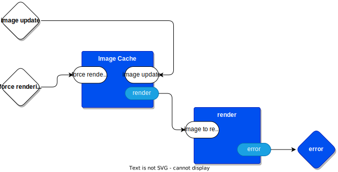

# Summary

Roughly, this is how I would solve the problem, as I understand it.  I've created the code for the control flow portion of this and have left hooks for the non-control-flow stuff like image rendering functionality.

I include the way that I would test this, too.


Deep in the bowels of this thing, I draw a State Machine something like


code repo: https://github.com/guitarvydas/kartik

# Topmost Overview
*[Thinking about https://docs.google.com/document/d/1EbK4AxDCDWonMa8KyGJFX4jllXXLew0qBsGxsmqoYqk/edit?pli=1]*

As I understand it, there are 3 inputs and 1 output and one unspecified image rendering thingie.

Is that about right?

![[kartik-RPlot black box.drawio.svg]]

## Inputs
1. `Plot!` - button push by user, data: don't care (maybe seen as a Boolean (actually a Bang, a pulse))
2. `frame tick` - fires every time there is a new frame to be displayed, data: don't care
3. `image from R` - fires every time R sends a new image, data: image
## Output
1. `query to R` - sent every time a new image is requested from R ; in this case, this is essentially the same as the `Plot!` input above
## Rendering Thingie
- a lump of code (a λ) that can be called to render an image, the image is passed in as a parameter
# Refinements 1-5

Basically, you considered the problem in more and more depth and teased out more details in a spiralling-in fashion.  

This is *iterative design*.  It happens.  Live with it.  

You can't help it, you have to live with this reality.  You wish that you had tools that supported iterative refinement of ideas.

Over-specifying details, such as worrying about extreme type-checking and imperative details of implementation, are a disaster at this point.  At best, with existing function-based languages, you write and preen code too-early, then refuse to change your code as you discover new nuances to the problem-at-hand.  Premature detailing is bad.  You want to arrive at *refinement 5* as quickly as possible (like, half-an-hour or so).

I like to use Lisp, because it supports this kind of approach, albeit in text, which ain't ideal.  I write some code and then find out that I was wrong.  It is easier for me to hit SELECT-ALL and DELETE and to write new code than it is for me to futz around with my existing code.

# Deeper
So, if you agree with my assessment of the top level of the problem (which ain't a given, I have been known to misunderstand), then we can dig deeper...

## RPlot

When the user pushes the `Plot!` button, a query is sent to R.

On every new frame, a `tick` event arrives.

When R is finished generating an image, the image is sent in on the `Image from R` input, as a message (an event).

There is, also, a `panic` situation if any kind of error occurs.  I'm too lazy to think about how to handle errors for this quickie example.


## Viewer



### Image Cache

A Leaf component.  See `leaf0d/leaf0d.odin:imagecache_proc` and friends.

The viewer keeps a local copy of the image-to-be-rendered and sends it to the renderer thingie whenever it is commanded to do so.  In this case, the `frame tick` input is a command to re-render the image.

If the local copy of the image is empty, the image cacher does not bother to send a render request to the renderer. That's 1-in, 0-out. That's a kind of thinking that function-based notation doesn't encourage.  It is *possible* to do this in a function-based way, but it is not the first thing that comes to mind when you are thinking that way.  Language affects thought.  If all you have are functions, then everything looks like a function, and, anything that doesn't fit the function mold is simply ignored.  In essence, functions are implementation details - figure out *what* you want to happen, then figure out *how* to map those actions into a function-based form.

Every time the `image cache` component receives an `image update` message, it throws away the previous image and stores the updated image.  

## Render

The `render` thingie is just a lump of code that renders whatever image it receives as its input parameter.  I guess that you could implement this as a function, but, I don't really care how you implement it.

The render thingie is poked every time an image needs to be rendered.  It does not get poked if there is nothing to render, which happens 
- when there is no frame tick, or,
- when the image is initially empty, or,
- when the image has not been updated since the last time it was rendered.

Instead of using ad-hoc logic (mutable variables and if-then-else), the above logic is tracked, in `Image Cache`, in a structured way using a State Machine.

# Incremental Testing

The diagrams are the specifications for the operation of the components.

Testing is simplified, since the inputs to a component must be Messages, and, the outputs of a component must be Messages.

Messages are 2-tuple structs
1. a port id
2. a datum

At this early stage, we're assuming that (1) port IDs are strings, and, that (2) datums are strings.  This isn't necessarily true going forward, but, strings make debugging easier, for now.

Start by testing the inner-most components and then working back outwards.

## Test 1
Does pressing `Plot!` cause a request to be sent to R?
## Test 2
Does a frame tick cause nothing to happen if we don't have any image at all?
## Test 3
1. frame tick
2. press `Plot1`
3. frame tick
4. frame tick
5. press `Plot1`
6.  frame tick

We expect the 1st frame tick to do nothing.

We expect every press of `Plot!` to generate a request to R.

We expect (2) followed by (3) to render an image.

We expect (4) to do nothing.

We expect (5) followed by (6) to render a new image (different from the image in (3)).

# JSON

The diagram is compiled to JSON.  Tabs on the diagram represent Container components.

This JSON was generated by uncommenting a line in `main.odin`:
> `reg.dump_diagram (diagram_source_file) // uncomment this line to get JSON dumped on console`
`

Note that the JSON defines only the Container components.  Leaf components are referenced, but, not defined.  Leaf components are (currently, for this example) defined in `leaf0d/leaf0d.odin` and declared to exist in `user0d/user0d.odin`.  Ideally, the IDE should figure out which Leaf components are being used and import them automagically, without any action from the user.

Containers contain a list of children components (Leaf or Container) and a set of connections between children and between the container itself.

```
[
    {
        "file": "kartik.drawio", 
        "name": "main", 
        "children": [
            {
                "name": "Image Faker", 
                "id": 6
            }, 
            {
                "name": "R Plot", 
                "id": 9
            }
        ], 
        "connections": [
            {
                "dir": 0, 
                "source": {
                    "name": "", 
                    "id": 0
                }, 
                "source_port": "Plot!", 
                "target": {
                    "name": "R Plot", 
                    "id": 9
                }, 
                "target_port": "Plot!"
            }, 
            {
                "dir": 0, 
                "source": {
                    "name": "", 
                    "id": 0
                }, 
                "source_port": "frame tick", 
                "target": {
                    "name": "R Plot", 
                    "id": 9
                }, 
                "target_port": "frame tick"
            }, 
            {
                "dir": 1, 
                "source": {
                    "name": "R Plot", 
                    "id": 9
                }, 
                "source_port": "query to R", 
                "target": {
                    "name": "Image Faker", 
                    "id": 6
                }, 
                "target_port": "query"
            }, 
            {
                "dir": 1, 
                "source": {
                    "name": "Image Faker", 
                    "id": 6
                }, 
                "source_port": "response", 
                "target": {
                    "name": "R Plot", 
                    "id": 9
                }, 
                "target_port": "image from R"
            }
        ]
    }, 
    {
        "file": "kartik.drawio", 
        "name": "R Plot", 
        "children": [
            {
                "name": "panic", 
                "id": 9
            }, 
            {
                "name": "viewer", 
                "id": 11
            }
        ], 
        "connections": [
            {
                "dir": 0, 
                "source": {
                    "name": "", 
                    "id": 0
                }, 
                "source_port": "image from R", 
                "target": {
                    "name": "viewer", 
                    "id": 11
                }, 
                "target_port": "image update"
            }, 
            {
                "dir": 0, 
                "source": {
                    "name": "", 
                    "id": 0
                }, 
                "source_port": "frame tick", 
                "target": {
                    "name": "viewer", 
                    "id": 11
                }, 
                "target_port": "force rendering"
            }, 
            {
                "dir": 1, 
                "source": {
                    "name": "viewer", 
                    "id": 11
                }, 
                "source_port": "error", 
                "target": {
                    "name": "panic", 
                    "id": 9
                }, 
                "target_port": "str"
            }, 
            {
                "dir": 3, 
                "source": {
                    "name": "", 
                    "id": 0
                }, 
                "source_port": "Plot!", 
                "target": {
                    "name": "", 
                    "id": 0
                }, 
                "target_port": "query to R"
            }
        ]
    }, 
    {
        "file": "kartik.drawio", 
        "name": "viewer", 
        "children": [
            {
                "name": "render", 
                "id": 6
            }, 
            {
                "name": "Image Cache", 
                "id": 8
            }
        ], 
        "connections": [
            {
                "dir": 0, 
                "source": {
                    "name": "", 
                    "id": 0
                }, 
                "source_port": "force rendering", 
                "target": {
                    "name": "Image Cache", 
                    "id": 8
                }, 
                "target_port": "force rendering"
            }, 
            {
                "dir": 0, 
                "source": {
                    "name": "", 
                    "id": 0
                }, 
                "source_port": "image update", 
                "target": {
                    "name": "Image Cache", 
                    "id": 8
                }, 
                "target_port": "image update"
            }, 
            {
                "dir": 1, 
                "source": {
                    "name": "Image Cache", 
                    "id": 8
                }, 
                "source_port": "render", 
                "target": {
                    "name": "render", 
                    "id": 6
                }, 
                "target_port": "image to render"
            }, 
            {
                "dir": 2, 
                "source": {
                    "name": "render", 
                    "id": 6
                }, 
                "source_port": "error", 
                "target": {
                    "name": "", 
                    "id": 0
                }, 
                "target_port": "error"
            }
        ]
    }, 
    {
        "file": "kartik.drawio", 
        "name": "Image Faker", 
        "children": [
            {
                "name": "Fake Image", 
                "id": 4
            }
        ], 
        "connections": [
            {
                "dir": 0, 
                "source": {
                    "name": "", 
                    "id": 0
                }, 
                "source_port": "query", 
                "target": {
                    "name": "Fake Image", 
                    "id": 4
                }, 
                "target_port": "input"
            }, 
            {
                "dir": 2, 
                "source": {
                    "name": "Fake Image", 
                    "id": 4
                }, 
                "source_port": "output", 
                "target": {
                    "name": "", 
                    "id": 0
                }, 
                "target_port": "response"
            }
        ]
    }
]
```

### Panic (Leaf)
An assert fail λ
### render (Leaf)
A λ that renders its parameter as an image on some target display.  None of these details are specified in this quickie example.  I've simply stubbed this out and printf a simple string.

At this point, the only thing we're interested in is getting the control flow correct.  It is assumed that displaying an image is well understood and handled by some code somewhere.
### Image Cache (Leaf)
The `Image Cache` Leaf component is the most involved item in this (very simple) project.

An `Image Cache` has 3 Semantic States
1. empty
2. fresh
3. stale

---
The State changes in an `Image Cache`can be represented by the diagram below.


*[Challenge: convert the diagram to XML.  Compile the XML to executable code in some language like Python.  [Aside: once upon a time, we did this but in Visual-C-1.5 using ad-hoc logic without using XML.  Sigh].  Hint: drawing editors like draw.io and Excalidraw  and yEd save drawings out in XML format.  The saved XML contains lots of detail about how the figures are to be rendered.  Most of that kind of stuff can simply be ignored.  I've used PROLOG to infer missing bits of semantic information, but, draw.io doesn't need that kind of treatement.]*

---
Each State consists of 3 λs:
1. entry code
2. in-state code (body)
3. exit code.

Most states in this project contain no entry nor exit code.  

The `fresh` State, though, does contain entry and exit code.  On entry, it saves the incoming image.  On exit, it sends the saved image to the `render` port.


---


Implementation-wise, the `empty` and `stale` states produce the same actions and might be folded together.  Semantically, though, they are distinct states (at least, from what I read in your problem description).

Each State reacts to the full set of possible incoming events in different ways. 

When in state `empty`:
- input `force rendering` does nothing and the machine remains in the `empty` state
- input `image update` causes the message datum - the image - to be saved in local state, and causes the machine to exit the `empty` state and to enter the `fresh` state
When in state `fresh`, 
- input `force rendering` causes the machine to `send()` the image on its output port `render` and the machine exits the `fresh` state and enters the `stale` state
- input `image update` causes the message datum to be saved in local state and the machine exits the `fresh` state and enters the `fresh` state. Q: can this be optimized to be a noop?  Where would we put the `send()` then? A: probably on the outgoing `force rendering` transition. Observation: this would change the underlying semantics of operation.  Q: is this a Good Thing?  Q: is this a better semantic? Q: would we, also, want to put a `send()` on the incoming `image update` transition?  Only the Architect defines what is *correct*.
When in state `stale`
- input `force rendering` causes the machine to move[^next] to the `stale` state (optimization: this is probably a no-op.  Such an optimization is probably benign, because there is no entry code nor exit code), nothing is output.
- input `image update` causes the message datum to be saved in local state and the machine moves[^next] to the `fresh` state

Note: a wonderful thing about structured state handling via State Machines is that you can insist that the programmer specify *something* for each possible input event - and, you can check for consistency (kinda like type checking, but, more so).  Odin's `switch` statement does this kind of consistency checking.  To get the full power of State Machine structuring, though, we need to add *entry code*, *exit code* and *body* code to each State.

[^next]: Remember, that *move* means a *transition* between states.  In full generality, a *transition* means (1) call the exit λ for the current state, (2) call the transition λ for the *transition*, and, (3) call the enter λ for the next state.

NB: as shown, if the `fresh` state gets an `image update` message, it will render the current image before saving the new one - is this the behaviour we desire? 

# Optimizations

- can you fold handler and enter/exit procs together?
	- yes, at least in some cases
- does this make it run faster?
	- yes, probably
- does this reduce readability?
	- yes
- which is more important, readability or speed?
	- it depends
	- if you want to communicate to other humans how the Architecture is designed , then readability is more important, at the expense of speed
	- if you want the machine to run faster, then speed is more important, at the expense of human readability

# This Looks Like a LOT of Code...

- OK, it *looks* like a lot of code when written out as text (see the repo)
	- but, it's mostly boilerplate and could be automated
	- it's so repetitive that even a dumb machine can generate it
	- we already have several diagram editors that save work in XML format, and, we already have tools (like Ohm-JS, PEG, etc.) that can grok structured textual input such as XML.  In other words we have *everything we need* to compile diagrams to executable programs. Not text-to-diagrams, but diagrams-to-text[^das].
	- and, this is why you can't trust a human to write this code as text correctly - humans are itching to make the code look smaller and they begin to cut corners, introducing gotchas and bugs
		- it's kinda like writing Loops instead of using Recursion - humans tend to get it right when they write Recursive procedures, but, they fool themselves into thinking that that is too boring and write ad-hoc Loops instead, and, then have to deal with bugs due to oversights
	- a diagram is worth a 1,000[^??] lines of code...

[^das]: In fact, we can cheat by compiling diagrams to text for existing languages like Python, Rust, Odin, etc.  We don't need to bother with the difficult task(s) of compiling from that point on, we can let the existing compilers do the heavy lifting.  See 31:50 https://publish.obsidian.md/programmingsimplicity/2023-07-30-Alan+Kay+quote

[^??]: or something like that

# Architecting vs. Optimization

- Alan Kay Architect vs. Optimizer, approx. 1:02 of https://youtu.be/PFc379hu--8 [^pc]

[^pc]: Thanks to Pawel Ceranka for pointing this video out to me.

# Other Languages

If the Odin code I've supplied is not understandable, I will gladly write this up using one of the languages I am currently using, like JavaScript, Python and Common Lisp.

I, also, am too familiar with C and 8-bit assembler, but, you don't see me volunteering to rewrite in one of those languages.  It is entirely possible, but, I simply don't want to spend the time.

In fact, I am sure that all of the above, including the 0D kernel, can be written in a higher-than-high-level pseudo-code format.  Transpiling such pseudo-code to Python, JS, Common Lisp, etc. should be a yawner.  Maybe in a few days or so...
# Appendix - Harel StateCharts

https://guitarvydas.github.io/2020/12/09/StateCharts.html
# See Also
### Blogs
- https://publish.obsidian.md/programmingsimplicity (see blogs that begin with a date 202x-xx-xx-)
- https://guitarvydas.github.io/ (up to about mid-2022)
### Videos
https://www.youtube.com/@programmingsimplicity2980
### Books
leanpub'ed (disclaimer: leanpub encourages publishing books before they are finalized)
https://leanpub.com/u/paul-tarvydas
### Discord
https://discord.gg/Jjx62ypR  everyone welcome, I invite more discussion of these topics
### Twitter
@paul_tarvydas
### Mastodon
(tbd, advice needed)
